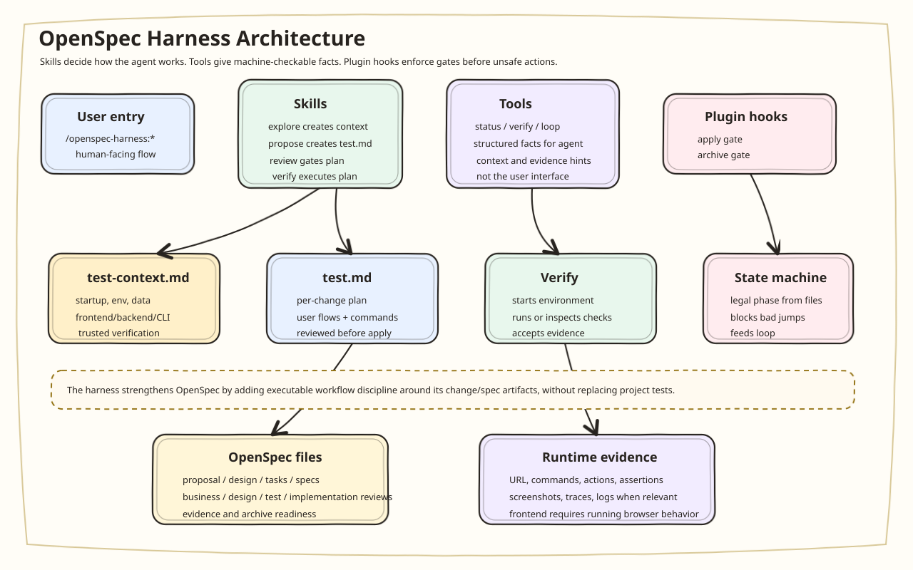
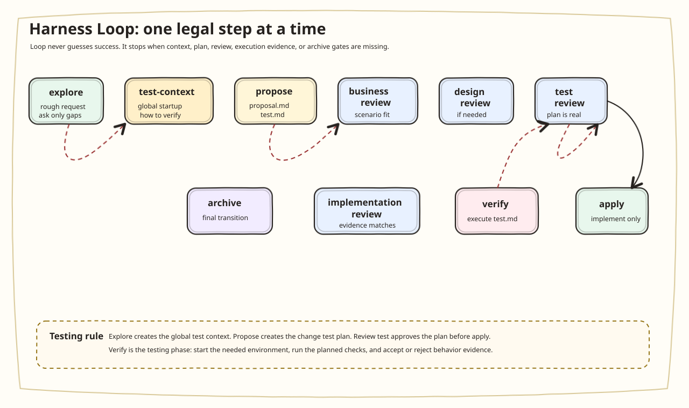
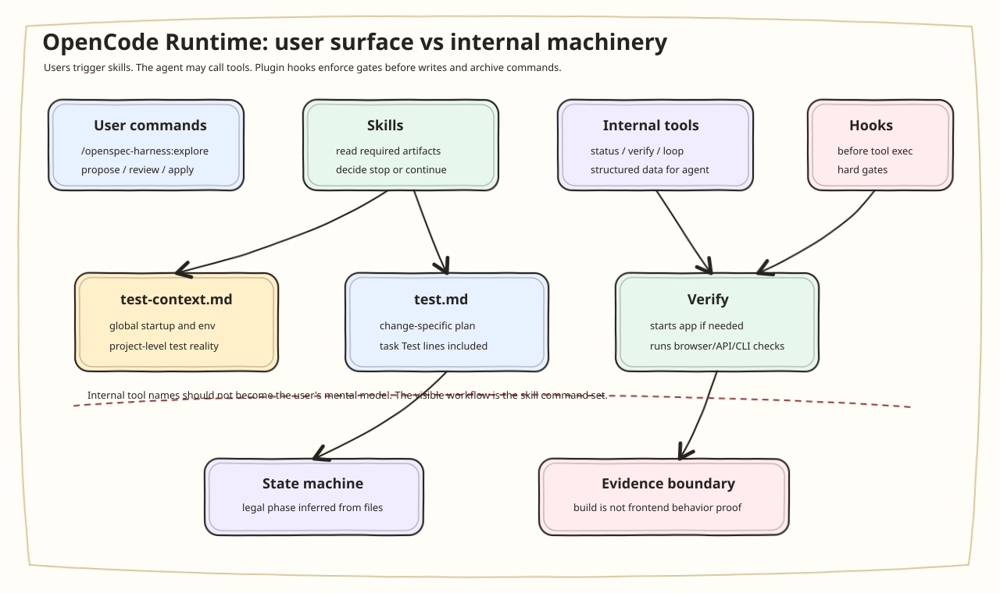

# OpenSpec Harness for OpenCode

[中文](#中文) | [English](#english)

## 中文

OpenSpec Harness 是一个面向 OpenCode 的 OpenSpec 强化层。它不替代
OpenSpec 的轻量变更模型，而是在 OpenSpec 之外增加一套可执行的
harness：用 skill 帮助 agent 选择正确工作方式，用状态机约束阶段推进，用
context 文档保持用户意图和项目事实同步，用 OpenCode 插件 hook 保护高风险
动作，用 tool 暴露机器可检查的状态和验证结果。

这个项目的核心目标不是让 agent 一次性自动跑完整个软件开发流程，而是先把
“探索 -> 提案 -> 审查 -> 实现 -> 验证 -> 归档”变成一个可治理、可暂停、
可复核、可循环推进的工作系统。

### 它强化了什么

原始 OpenSpec 更擅长表达变更和规范演进，但 agent 很容易绕过关键上下文：
业务场景没问清就写 proposal，proposal 还没被审查就开始改代码，任务完成却
没有证据，最后用 `openspec archive` 把不完整的变更归档。

OpenSpec Harness 在这些薄弱点上增加了六类协作能力：

| 强化层 | 项目实现 | 解决的问题 |
| --- | --- | --- |
| Skill 体系 | `.opencode/skills/openspec-harness-*/SKILL.md` | 把探索、提案、审查、实现、验证、归档拆成可加载的 agent 操作规程。 |
| State machine | `lib/state-machine.js` | 从 OpenSpec 文件推导当前状态，定义哪些阶段可以继续推进。 |
| Context sync | `openspec/harness/context.md`、`decision-log.md` | 用户纠偏或需求变化后，先同步长期上下文，再决定继续、更新 proposal/test，还是重新对齐。 |
| Plugin gates | `.opencode/plugins/openspec-harness.ts` | 在 OpenCode 执行工具前拦截实现写入和归档命令。 |
| Tool interface | internal status、verify、loop、context/evidence helper tools | 让 agent 调用结构化工具，而不是只靠自然语言自我判断；这些不是用户需要直接感知的入口。 |
| Testing context verifier | `lib/test-context-verifier.js` | 识别前端/后端/CLI 测试环境，阻止模型把 typecheck/build/curl 当成交互行为证据。 |

### 架构



这套结构借鉴 harness 思想：agent 不是直接面对整个仓库自由行动，而是在一个
可观测的运行外壳里工作。harness 负责提供入口、上下文、状态、闸门和证据规
则；agent 仍然负责阅读、推理和实现，但每次阶段迁移都必须经过明确的检查点。

### Loop 思想

当前 loop 不是全自动执行器，而是一个单步、门控、可解释的推进器。它读取当前
OpenSpec 变更状态，然后给出下一步合法动作；如果门禁失败，它返回阻塞原因，
而不是尝试绕过。



对应的 CLI 和插件工具是：

```bash
node ./bin/openspec-harness.mjs loop --change <change>
```

在 OpenCode 中则由插件内部 tool 提供同样能力；用户入口仍然是
`/openspec-harness:loop`。

### OpenCode 命令

项目在 `opencode.json` 中注册了 namespaced commands：

```text
/openspec-harness:explore
/openspec-harness:propose
/openspec-harness:review
/openspec-harness:apply
/openspec-harness:verify
/openspec-harness:archive
/openspec-harness:status
/openspec-harness:doctor
/openspec-harness:loop
/openspec-harness:context-sync
/openspec-harness:docs-sync
```

命令使用 `/openspec-harness:<phase>` 作为用户入口；对应 skill 使用
`openspec-harness-<phase>`，因为 OpenCode skill 名称不使用冒号。

### Skill 到阶段的映射

| Skill | 阶段 | 主要约束 |
| --- | --- | --- |
| `openspec-harness-explore` | 探索 | 识别业务场景、风险和验证信号；缺少 `test-context.md` 时先建立全局测试上下文。 |
| `openspec-harness-propose` | 提案 | 创建 `proposal.md`、`test.md`、`tasks.md`、必要的 `design.md` 和 delta specs。 |
| `openspec-harness-review` | 审查 | 生成 machine-checkable 的 business/design/test/implementation review artifact。 |
| `openspec-harness-apply` | 实现 | 只在 apply gate 通过后实现一个任务切片，记录实现证据；最终测试交给 verify。 |
| `openspec-harness-verify` | 验证 | 按 `test-context.md` 和 `test.md` 执行/核验测试，检查 evidence、reviews 和 strict OpenSpec validation。 |
| `openspec-harness-archive` | 归档 | 只有 archive gate 和验证证据通过后才允许 `openspec archive <change>`。 |
| `openspec-harness-loop` | 循环推进 | 推荐下一步合法动作，包含测试上下文、测试计划和 review 阻塞原因。 |
| `openspec-harness-context-sync` | 上下文重对齐 | 用户纠偏、需求变化或实现偏离时，更新 context 层文档并建议是否重走 proposal/test。 |
| `openspec-harness-docs-sync` | 文档同步 | 检查 README、design、context 文档、commands、skills、tools 和 package metadata 是否一致。 |

### Skill、Tool、Plugin 如何联动

三者不是重复能力，而是分层协作：

| 层 | 负责什么 | 不负责什么 |
| --- | --- | --- |
| Skill | 给 agent 阶段化操作规程：该读哪些文件、能做什么、何时停止、如何记录证据。 | 不提供硬拦截；skill 是行为指导，不是安全边界。 |
| Tool | 提供结构化、机器可检查的操作：状态、门禁验证、loop 建议、测试上下文线索和证据验证。 | 不直接决定 agent 应该如何写 proposal 或实现代码；也不应该作为主要用户界面。 |
| Plugin | 把 hook、system context 和 custom tools 接进 OpenCode 运行时。 | 不替代 OpenSpec，也不替代项目自己的测试框架。 |

典型链路：

1. 用户先运行 `/openspec-harness:explore`。如果项目没有 `openspec/harness/test-context.md`，explore 会把全局测试启动方式、环境前置条件和可信验证方式整理成测试上下文。
2. `/openspec-harness:propose` 基于需求和测试上下文创建 `proposal.md`、`test.md`、`tasks.md`、必要的 `design.md` 和 delta specs。
3. `/openspec-harness:review business|design|test <change>` 分别审查业务、设计和测试方案；`test.md` 必须通过 test review 后才能进入实现。
4. `/openspec-harness:apply` 只负责按任务实现并记录实现证据，不把 build/unit test 当成最终功能验证。
5. `/openspec-harness:verify` 才是真正测试环节：它按 `test.md` 和 `test-context.md` 启动环境、执行检查、核验行为证据；前端可见变更必须验证运行中的应用和浏览器级交互。
6. `/openspec-harness:review implementation <change>` 审查实现和验证证据是否匹配 proposal、test plan、tasks 和 specs。
7. `/openspec-harness:archive` 只有在 archive gate、测试验证证据和 OpenSpec strict validation 都通过后才允许归档。

如果用户在任意阶段提出“不是这个意思”“改成”“我要的是”等纠偏反馈，先运行
`/openspec-harness:context-sync`。它不会默认重走完整流程，而是判断这是文字澄清、
测试策略变化、需求转向，还是实现与意图冲突，然后决定继续当前 change、更新
proposal/test，或重新对齐。

发布前或插件行为变化后运行 `/openspec-harness:docs-sync`，确保 context 层文档
不是过期说明：README、`docs/design.md`、`opencode.json`、skills、tools 和
package metadata 应描述同一个实际系统。

### Tool 功能

OpenCode 插件暴露给 agent 的内部 tools 对应 CLI 能力。用户日常应该使用
`/openspec-harness:*` 命令，不需要记住内部 tool 名：

| Tool | CLI | 用途 |
| --- | --- | --- |
| `openspec_harness_status` | `openspec-harness status --json` | 查看 active changes、状态、review、任务和证据摘要。 |
| `openspec_harness_verify` | `openspec-harness verify --mode <apply|archive> --change <change>` | 验证 apply/archive gate；archive 模式同时检查 behavior evidence。 |
| `openspec_harness_loop` | `openspec-harness loop --change <change>` | 推荐下一步合法动作；可在显式允许时执行机械 archive。 |
| `openspec_harness_context_sync` | `openspec-harness context-sync --feedback <text>` | 分析用户纠偏或需求变化，更新 context 层文档并建议是否影响当前 change。 |
| `openspec_harness_docs_sync` | `openspec-harness docs-sync` | 检查 context 文档、README/design、commands、skills、tools 和 package metadata 是否同步。 |
| Internal context helpers | CLI helper surface | 辅助识别项目测试环境，产出 test-context/test-plan 所需线索。 |
| Internal evidence helpers | CLI helper surface | 辅助检查行为证据是否覆盖当前 change 的验证计划。 |

### OpenCode 插件与工具

插件位于 `.opencode/plugins/openspec-harness.ts`，运行时代码在
`lib/opencode-plugin.js`，当前提供三类能力：



`tool.execute.before` 是关键：它让 apply 和 archive 不再只是提示词约束，而是
OpenCode 工具执行前的硬检查。

插件默认不向会话自动注入状态文本，避免 OpenCode 终端被背景上下文或原始输出占据。
需要状态时使用 `/openspec-harness:status` 或 `openspec_harness_status` 工具；如确实需要每轮注入，可显式设置 `OPENSPEC_HARNESS_SYSTEM_CONTEXT=1`。

### 文件状态机

状态不是保存在隐藏数据库里，而是从 OpenSpec 文件推导：

```text
openspec/harness/constitution.md
openspec/harness/context.md
openspec/harness/decision-log.md
openspec/harness/test-context.md
openspec/changes/<change>/proposal.md
openspec/changes/<change>/design.md
openspec/changes/<change>/test.md
openspec/changes/<change>/tasks.md
openspec/changes/<change>/reviews/business.md
openspec/changes/<change>/reviews/design.md
openspec/changes/<change>/reviews/test.md
openspec/changes/<change>/reviews/implementation.md
openspec/changes/<change>/evidence.md
openspec/specs/
```

这样做的好处是 review、evidence 和状态迁移都能进入版本控制，也能被普通
OpenSpec 工具继续处理。

### Constitution

`openspec/harness/constitution.md` 是治理层。它定义了不可绕过的规则：

- 业务理解先于实现。
- Review 是状态迁移，不是事后装饰。
- 没有 evidence 的已完成任务不算完成。
- 测试通过是重要证据，但不能替代业务正确性。
- Archive 是最终状态迁移，必须由机器 gate 检查。

### 安装与验证

```bash
npm install
npm run validate
```

### NPM Package And OpenCode Global Install

这个项目按 scoped npm package 组织，包名是：

```text
@davidyuan1223/openspec-harness-opencode
```

OpenCode 全局插件不是直接引用仓库源码，而是从全局 OpenCode 配置目录的
`node_modules` 中按包名引入：

```js
export { OpenSpecHarnessPlugin as GlobalOpenSpecHarnessPlugin } from "@davidyuan1223/openspec-harness-opencode";
```

开发期可以运行：

```bash
npm run install:opencode-global
```

该命令会先 `npm pack` 当前项目，再把打包后的 scoped package 安装到
`~/.config/opencode`，并写入上面的全局 plugin wrapper。仓库还提供
`.github/workflows/publish-github-packages.yml`：创建 GitHub Release 或手动触发
workflow 时，会用 `GITHUB_TOKEN` 发布到 GitHub Packages registry
`https://npm.pkg.github.com/`。发布后，可以设置
`OPENSPEC_HARNESS_PACKAGE_SPEC=@davidyuan1223/openspec-harness-opencode@<version>`
让安装脚本从 registry 安装指定版本。

### Windows And macOS Support

插件运行层按 Windows 和 macOS 双环境设计：

- CLI 使用 Node.js 入口 `bin/openspec-harness.mjs`，不依赖 Bash-only 脚本。
- 全局安装脚本在 macOS/Linux 默认写入 `~/.config/opencode`，在 Windows 默认写入 `%APPDATA%\\opencode`；也可以通过 `OPENCODE_CONFIG_DIR` 显式覆盖。
- 开发期全局安装会使用 `npm` 或 Windows 下的 `npm.cmd`，OpenCode headless smoke 会使用 `opencode` 或 Windows 下的 `opencode.cmd`。
- apply/archive hook 同时识别 POSIX 路径、Windows 盘符路径、反斜杠 OpenSpec artifact 路径、`/dev/null` 和 `NUL`。
- shell 写入检测覆盖常见 Bash 重定向、`tee`、PowerShell `Set-Content` 和 `Add-Content`。
- CI 在 `macos-latest` 和 `windows-latest` 上执行 `npm ci`、`npm run validate` 和 `npm pack --dry-run`。

默认验证包含：

- Node unit tests。
- OpenCode fixture shape validation。
- `openspec validate --all --strict --no-interactive`。

可选验证：

```bash
npm run test:e2e
npm run test:opencode-headless
npm run validate:all
```

### CLI

```bash
openspec-harness status --json
openspec-harness verify --mode apply --change <change>
openspec-harness verify --mode archive --change <change>
openspec-harness loop --change <change>
openspec-harness doctor
```

### Test Context And Change Test Plan

测试环境不再被建模成用户需要单独操作的刚性 JSON checklist。它被拆成两层：

- `openspec/harness/test-context.md`：全局测试上下文，说明项目如何启动、依赖什么环境、哪些测试命令可信、前端/后端/CLI 如何做运行时验证。
- `openspec/changes/<change>/test.md`：当前变更的测试计划，说明这次改动要验证哪些用户流程、运行哪些检查、需要什么证据。

各阶段职责：

- `explore` 在缺少 `test-context.md` 时先产出全局测试上下文，并向用户确认无法推断的环境前置条件。
- `propose` 产出 `test.md`，并在 `tasks.md` 中写入任务级 `Test:` 行。
- `review test` 审查测试计划是否真的覆盖当前 change，而不是泛泛写“运行测试”。
- `apply` 负责实现和记录实现证据，但不承担最终测试判定。
- `verify` 是真正测试环节，按 `test.md` 和 `test-context.md` 启动环境、执行检查、记录证据。

前端或 fullstack 的用户可见变更必须启动应用并做浏览器级功能验证；typecheck、build、lint、普通单测和 `curl localhost` 只能作为辅助信号，不能单独证明前端功能正确。

### 当前范围

已实现：

- OpenCode namespaced commands。
- OpenCode harness skills。
- 文件驱动的 OpenSpec Harness 状态推导。
- business、design、test、implementation 四类 review gate。
- apply gate：阻止未过审查的实现写入。
- archive gate：阻止不完整变更执行 `openspec archive <change>`。
- 可选系统上下文注入：显式开启后把 active change 状态注入 OpenCode 会话。
- `status`、`verify`、`loop`、`context helpers`、`test-plan helpers`、`evidence helpers` 自定义工具。
- testing context verifier：识别测试环境并要求与变更 surface 匹配的结构化证据。
- 默认单元测试、fixture validation、可选 headless OpenCode smoke test。

尚未实现：

- 自动生成真实 OpenSpec artifact 的完整 authoring agent。
- DeepSeek 支持下的真实 `opencode serve` 长循环自动化。
- 多 worktree loop orchestration。
- 自动文档同步 agent。

## English

OpenSpec Harness is an OpenCode-oriented control layer for OpenSpec. It does not
replace OpenSpec's lightweight change model. It adds an executable harness around
it: skills define how the agent should work, a state machine defines legal phase
movement, OpenCode plugin hooks block unsafe operations, and tools expose
machine-checkable status and verification.

The goal is not a fully autonomous development loop on day one. The goal is to
make "explore -> propose -> review -> apply -> verify -> archive" governable,
pausable, reviewable, and loop-friendly.

### What It Strengthens

Plain OpenSpec is good at representing changes and spec evolution, but agents can
still skip important context: creating proposals before business scenarios are
clear, editing implementation before reviews pass, marking tasks complete without
evidence, or archiving an incomplete change with `openspec archive`.

OpenSpec Harness adds five collaboration layers:

| Layer | Implementation | Problem addressed |
| --- | --- | --- |
| Skills | `.opencode/skills/openspec-harness-*/SKILL.md` | Turns each phase into a loadable agent operating procedure. |
| State machine | `lib/state-machine.js` | Infers the current phase from OpenSpec files and defines legal progress. |
| Plugin gates | `.opencode/plugins/openspec-harness.ts` | Blocks implementation writes and archive commands before tool execution. |
| Tools | internal status, verify, loop, context/evidence helper tools | Gives the agent structured operations instead of self-judgement in prose; these are not the primary user-facing entrypoints. |
| Testing context verifier | `lib/test-context-verifier.js` | Detects frontend/backend/CLI test environments and prevents typecheck/build/curl from masquerading as behavior evidence. |

### Architecture


This follows the harness idea: the agent does not act freely against the whole
repository. It works inside an observable runtime shell. The harness supplies
entrypoints, context, state, gates, and evidence rules; the agent still reads,
reasons, and implements, but every phase transition has an explicit checkpoint.

### Loop Model

The current loop is not a full auto-runner. It is a single-step, gate-aware,
explainable driver. It reads the current OpenSpec change state and recommends the
next legal action. If a gate fails, it returns the blocking reasons instead of
trying to bypass them.


The CLI entrypoint is:

```bash
node ./bin/openspec-harness.mjs loop --change <change>
```

In OpenCode, the same capability is exposed through an internal plugin tool. The
user-facing entrypoint remains `/openspec-harness:loop`.

### OpenCode Commands

`opencode.json` registers these namespaced commands:

```text
/openspec-harness:explore
/openspec-harness:propose
/openspec-harness:review
/openspec-harness:apply
/openspec-harness:verify
/openspec-harness:archive
/openspec-harness:status
/openspec-harness:doctor
/openspec-harness:loop
```

Commands use `/openspec-harness:<phase>` as the user-facing shape. Skills use
`openspec-harness-<phase>` because OpenCode skill names avoid colons.

### Skill Phase Map

| Skill | Phase | Main constraint |
| --- | --- | --- |
| `openspec-harness-explore` | Explore | Identify scenarios, risks, and validation signals; create `test-context.md` when missing. |
| `openspec-harness-propose` | Propose | Create `proposal.md`, `test.md`, `tasks.md`, required `design.md`, and delta specs. |
| `openspec-harness-review` | Review | Produce machine-checkable business/design/test/implementation review artifacts. |
| `openspec-harness-apply` | Apply | Implement one task slice after gates pass and record implementation evidence; final testing belongs to verify. |
| `openspec-harness-verify` | Verify | Execute or inspect checks from `test.md` using `test-context.md`, then check evidence, reviews, and strict OpenSpec validation. |
| `openspec-harness-archive` | Archive | Allow `openspec archive <change>` only after archive and verification gates pass. |
| `openspec-harness-loop` | Loop | Recommend the next legal action, including test context, test plan, and review blockers. |
| `openspec-harness-context-sync` | Context sync | Realign context after user corrections, requirement changes, or implementation drift. |
| `openspec-harness-docs-sync` | Docs sync | Check README, design docs, context docs, commands, skills, tools, and package metadata for drift. |

### How Skills, Tools, And Plugin Work Together

The three layers are complementary, not interchangeable:

| Layer | Responsibility | Not responsible for |
| --- | --- | --- |
| Skill | Gives the agent phase-specific operating rules: what to read, what it may do, when to stop, and how to record evidence. | Hard enforcement; a skill is guidance, not a security boundary. |
| Tool | Provides structured, machine-checkable operations: status, gate verification, loop recommendation, test-context signals, and evidence verification. | Authoring the proposal or implementation strategy by itself, or becoming the main user interface. |
| Plugin | Connects hooks, system context, and custom tools into the OpenCode runtime. | Replacing OpenSpec or the project's own test framework. |

Typical flow:

1. The user starts with `/openspec-harness:explore`; if `openspec/harness/test-context.md` is missing, explore drafts the global testing context.
2. `/openspec-harness:propose` creates `proposal.md`, `test.md`, `tasks.md`, required `design.md`, and delta specs.
3. `/openspec-harness:review business|design|test <change>` reviews business assumptions, technical design, and the credibility of the test plan.
4. `/openspec-harness:apply` implements task slices and records implementation evidence, but does not own final verification.
5. `/openspec-harness:verify` is the testing phase: it follows `test.md` and `test-context.md`, runs or inspects checks, and records accepted evidence.
6. `/openspec-harness:review implementation <change>` checks that implementation and evidence match the proposal, test plan, tasks, and specs.
7. `/openspec-harness:archive` is allowed only when archive gates, verification evidence, and strict OpenSpec validation pass.

When the user corrects intent at any phase, run
`/openspec-harness:context-sync` before continuing stale assumptions. It does
not automatically restart the whole flow; it classifies the correction as a
clarification, test-strategy change, requirement pivot, or implementation
contradiction, then recommends whether to continue, update proposal/test
artifacts, or realign the change.

After plugin behavior changes or before publishing, run
`/openspec-harness:docs-sync` to ensure README, `docs/design.md`,
`opencode.json`, skills, tools, context docs, and package metadata describe the
same actual system.

### Tool Surface

The OpenCode plugin exposes internal tools for the agent. Users normally invoke
the `/openspec-harness:*` commands instead of remembering tool names:

| Tool | CLI | Purpose |
| --- | --- | --- |
| `openspec_harness_status` | `openspec-harness status --json` | Inspect active changes, state, reviews, tasks, and evidence summary. |
| `openspec_harness_verify` | `openspec-harness verify --mode <apply|archive> --change <change>` | Verify apply/archive gates; archive mode also checks behavior evidence. |
| `openspec_harness_loop` | `openspec-harness loop --change <change>` | Recommend the next legal action; can execute mechanical archive only when explicitly allowed. |
| `openspec_harness_context_sync` | `openspec-harness context-sync --feedback <text>` | Analyze user correction or requirement drift and optionally update context-level docs. |
| `openspec_harness_docs_sync` | `openspec-harness docs-sync` | Check context docs, README/design, commands, skills, tools, and package metadata for drift. |
| Internal context helpers | CLI helper surface | Gather project test-environment signals for `test-context.md` and `test.md`. |
| Internal evidence helpers | CLI helper surface | Check whether behavior evidence covers the current change's test plan. |

### OpenCode Plugin And Tools

The plugin wrapper lives at `.opencode/plugins/openspec-harness.ts`; runtime code
lives in `lib/opencode-plugin.js`. It currently exposes three capability groups:


`tool.execute.before` is the important part: apply and archive are no longer just
prompt instructions. They are hard checks before OpenCode tools execute.

By default the plugin does not inject state text into every session turn, which
keeps the OpenCode terminal from being filled by background context or raw
command output. Use `/openspec-harness:status` or the `openspec_harness_status`
tool when status is needed; set `OPENSPEC_HARNESS_SYSTEM_CONTEXT=1` only when
per-turn context injection is desired.

### File-Backed State Machine

State is inferred from files rather than stored in a hidden database:

```text
openspec/harness/constitution.md
openspec/harness/context.md
openspec/harness/decision-log.md
openspec/harness/test-context.md
openspec/changes/<change>/proposal.md
openspec/changes/<change>/design.md
openspec/changes/<change>/test.md
openspec/changes/<change>/tasks.md
openspec/changes/<change>/reviews/business.md
openspec/changes/<change>/reviews/design.md
openspec/changes/<change>/reviews/test.md
openspec/changes/<change>/reviews/implementation.md
openspec/changes/<change>/evidence.md
openspec/specs/
```

That keeps reviews, evidence, and transitions version-controlled and compatible
with normal OpenSpec tooling.

### Constitution

`openspec/harness/constitution.md` is the governance layer. It defines the
non-bypassable rules:

- Business understanding precedes implementation.
- Reviews are state transitions, not decoration after the fact.
- A completed task without evidence is not complete.
- Passing tests are useful evidence, but not proof of business correctness.
- Archive is a final transition and must be machine-gated.

### Install And Validate

```bash
npm install
npm run validate
```

### NPM Package And OpenCode Global Install

This project is packaged as the scoped npm package:

```text
@davidyuan1223/openspec-harness-opencode
```

The global OpenCode plugin should import the installed package from the global
OpenCode config directory's `node_modules`, not from repository source files:

```js
export { OpenSpecHarnessPlugin as GlobalOpenSpecHarnessPlugin } from "@davidyuan1223/openspec-harness-opencode";
```

For local development, run:

```bash
npm run install:opencode-global
```

The script packs the current project, installs that scoped package into
`~/.config/opencode`, and writes the global plugin wrapper above. The repository
also includes `.github/workflows/publish-github-packages.yml`: publishing a
GitHub Release, or manually dispatching the workflow, publishes the package to
the GitHub Packages registry at `https://npm.pkg.github.com/` using
`GITHUB_TOKEN`. After the package is published, set
`OPENSPEC_HARNESS_PACKAGE_SPEC=@davidyuan1223/openspec-harness-opencode@<version>`
to install a registry version instead of the local packed tarball.

### Windows And macOS Support

The plugin runtime is designed for both Windows and macOS:

- The CLI uses the Node.js entrypoint `bin/openspec-harness.mjs` and does not
  depend on Bash-only scripts.
- The global installer writes to `~/.config/opencode` on macOS/Linux and
  `%APPDATA%\\opencode` on Windows by default. `OPENCODE_CONFIG_DIR` can
  override either location.
- Local global install uses `npm` or `npm.cmd` on Windows. The OpenCode headless
  smoke test uses `opencode` or `opencode.cmd` on Windows.
- Apply/archive hooks understand POSIX paths, Windows drive-letter paths,
  backslash OpenSpec artifact paths, `/dev/null`, and `NUL`.
- Shell-write detection covers common Bash redirection, `tee`, PowerShell
  `Set-Content`, and PowerShell `Add-Content`.
- CI runs `npm ci`, `npm run validate`, and `npm pack --dry-run` on
  `macos-latest` and `windows-latest`.

Default validation includes:

- Node unit tests.
- OpenCode fixture shape validation.
- `openspec validate --all --strict --no-interactive`.

Optional checks:

```bash
npm run test:e2e
npm run test:opencode-headless
npm run validate:all
```

### CLI

```bash
openspec-harness status --json
openspec-harness verify --mode apply --change <change>
openspec-harness verify --mode archive --change <change>
openspec-harness loop --change <change>
openspec-harness doctor
```

### Test Context And Change Test Plan

Testing is modeled as context plus a per-change plan, not as a standalone JSON
workflow the user has to run.

- `openspec/harness/test-context.md` is the global testing context: how the
  project starts, what environment is required, which commands are meaningful,
  and how frontend/backend/CLI runtime behavior should be verified.
- `openspec/changes/<change>/test.md` is the current change's test plan: changed
  surfaces, user flows, commands, runtime checks, and evidence expectations.

Stage responsibilities:

- `explore` creates or updates `test-context.md` when the project lacks one.
- `propose` creates `test.md` and task-level `Test:` lines.
- `review test` challenges whether the test plan is credible for the current
  change and the project context.
- `apply` implements and records implementation evidence, but does not own final
  verification.
- `verify` is the actual testing stage: it follows `test.md` and
  `test-context.md`, runs or inspects the checks, and records accepted evidence.

For frontend or fullstack user-visible changes, verify must exercise the running
application through browser-level behavior. Typecheck, build, lint, ordinary
unit tests, and `curl localhost` are supporting signals only.

### Current Scope

Implemented:

- OpenCode namespaced commands.
- OpenCode harness skills.
- File-backed OpenSpec Harness state inference.
- Business, design, test, and implementation review gates.
- Apply gate that blocks implementation writes before reviews pass.
- Archive gate that blocks incomplete `openspec archive <change>` runs.
- Optional system context injection for active change state.
- `status`, `verify`, `loop`, and internal context/evidence helper surfaces.
- Testing context verifier that requires evidence matching the changed surface.
- Default unit tests, fixture validation, and optional headless OpenCode smoke test.

Not implemented yet:

- Full authoring agent for real OpenSpec artifact generation.
- Real DeepSeek-backed long-running `opencode serve` automation.
- Multi-worktree loop orchestration.
- Automatic documentation synchronization agent.
